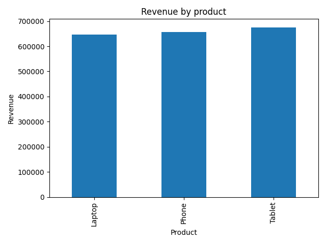
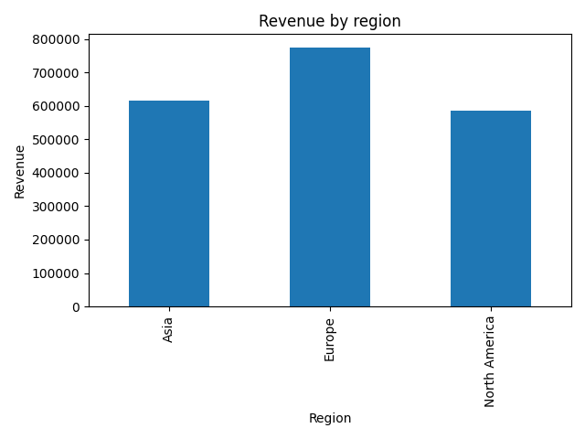
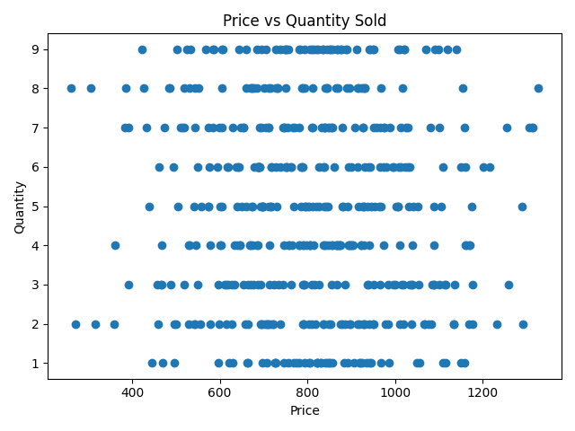

# Sales Data Analysis with Python

This project demonstrates how Python can be used to analyze sales data from a CSV dataset and generate visual insights automatically.

The script loads raw sales data, computes revenue metrics, and produces charts that highlight product performance, regional sales distribution, and relationships between price and quantity sold.

This type of workflow can help automate basic business data analysis and reduce manual spreadsheet work.

---

## Project Structure

```
sales-data-analysis-python/
│
├── data/
│   └── sales_data.csv
│
├── output/
│   ├── revenue_by_product.png
│   ├── revenue_by_region.png
│   └── price_vs_quantity.png
│
├── analysis.py
└── README.md
```

---

## Features

- Load and process CSV datasets using Python
- Compute revenue metrics from price and quantity
- Aggregate data by product and region
- Generate visualizations automatically
- Export charts for reporting or exploration

---

## Technologies

- Python
- Pandas
- Matplotlib

---

## Example Visualizations

### Revenue by Product


### Revenue by Region


### Price vs Quantity


---

## How to Run

Install dependencies:

```
pip install pandas matplotlib
```

Run the script:

```
python analysis.py
```

The generated charts will be saved in the `output/` folder.

---

## Use Case

This project illustrates how Python can be used to automate exploratory data analysis for business datasets.  
The same approach can easily be adapted to other CSV datasets to generate quick insights and visual summaries.
